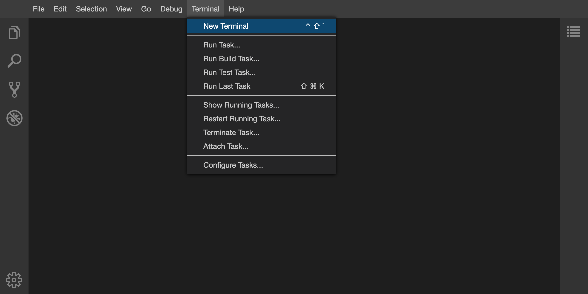

# Unix course – Introduction to basic Unix commands

[[_TOC_]]

On Unix, every user has a unique user name. When they log onto the system, they are placed in a home directory, which is a portion of the disk space reserved just for them. When you log onto a Unix system, your main interface to the system is  called the Unix Shell. This is the program that presents you with the dollar sign (`$`) prompt. This prompt means that the shell is ready to accept your typed commands. It is often preceded by the user name as well as the current directory.

Unix commands are strings of characters typed in at the keyboard. To  run a command, you just type it in and press the *Enter* key. We will look at several of the most common commands below.
Commands often have _parameters_, e. g. a file to work on. Theses are typed in after the command and are separated by spaces, e. g. `less pi_results.txt` opens the file `pi_results.txt` for reading.

In addition, Unix extends the power of commands by using special flags or *switches*. Switches are usually preceded with a dash (`-`), e. g. `ls -lh`.

## List of commands

| Command             | Description                                                  |
| ------------------- | ------------------------------------------------------------ |
| `pwd`               | print current (working) directory            |
| `ls`                | list contents of the current directory                       |
| &#10551; `-l`    | **l**ong (detailed) listing |
| &#10551; `-h` | with **h**uman readable numbers |
| `cd`                | change to another directory                                  |
| `mkdir`             | make a new directory                                         |
| `mv`                | move or rename a file or directory                           |
| `cp`                | copy file                                                    |
| &#10551; `-r`       | copy directory tree (**r**ecursively)                        |
| `file` | determine file type |
| `echo`              | print a line of text                                   |
| `less`              | display contents of a file (press q to quit)                 |
| `tail` | output the last part of a file |
| &#10551; `-f` | **f**ollow appended data as the file grows |
| `grep`              | list text lines containing a particular string of text |
| &#10551; `-v` | output only non-matching lines |
| `wc` | count lines, words, and bytes in a file |
| `cat`               | concatenate (combine) two or more files                      |
| `df`                | show disk free information                                   |
| &#10551; `-h` | with **h**uman readable numbers |
| `find`              | find files in a directory tree                               |
| `man`               | display program manual for a command                         |
| `ps -x`         | list one's own running programs / processes (e**x**tended list) |
| `kill`              | kill process                                                 |
| &#10551; `-9`       | kill process immediately (SIGKILL=**9**)           |
| `rm`                | remove a file                                                |
| &#10551; `-r`       | remove a directory tree (**r**ecursively)                    |
| `rmdir`             | remove an empty directory                                    |
| `chmod`             | change mode (security permissions) of file or directory      |
| &#10551; `ugo+-rwx` | **u**ser (owner), **g**roup, **o**ther (world), add(**+**), remove(**-**), **r**ead, **w**rite, **e**xecute |
| `./myprogram` | run the local executable file `myprogram` |
| `sed 's/ab/cd'` | transform text, e. g. replace all occurrences of 'ab' with 'cd' |
| `wget` | network downloader (downloads files from the Web) |
| `gzip` | compress a file |
| `gunzip` | uncompress a file |
| `*`                 | wildcard representing any combination of characters          |
| **Places** |  |
| `~`                 | your home directory                                          |
| `.`                 | current directory                                            |
| `..`                | parent directory                                             |
| **Pipes** |  |
| `>`                 | send output to a file                                        |
| `>>`                | append (add) output to a file                                |
| `\|`                 | pipe output from one command as input to another             |

Download as [PDF](cheatsheet.pdf) or separate [MarkDown](cheatsheet.md).

## Tutorial

During this tutorial you will use many of the **commands above**. Your task is to **identify** 
**the correct commands and execute them**. Feel free to experiment. Take a look at the 
solution if absolutely necessary.

This tutorial is based on the [tutorial](https://gitlab.ub.uni-bielefeld.de/denbi/unix-course) that was created by the de.NBI Cloud Bielefeld administrators.
The first two sections (01 and 02) describe how to access the CLUM 2021 environment for this tutorial.
Participants need a web browser and an active ELIXIR account. 

### 01 - Accessing SimpleVM

When accessing a Unix system running as a virtual machine in the cloud one would normally log into
it via SSH and would be getting presented with a terminal.
For the sake of this tutorial the access route to the terminal is via web browser.
Every participant has access to a prepared virtual machine running a web-based development environment called Theia IDE.

**Accessing Theia IDE**

This workshop is powered by [SimpleVM](https://cloud.denbi.de/simplevm/).
Every participant should have received a mail containing the actual link to their VM.

After successful login the Theia IDE screen appears. The screen is usually divided into 3 sections:
Editor pane in the center, file browser on the left, terminal at the bottom.
This tutorial will primarily focus on the use of the terminal.

> **Note:** Access to your own private virtual machine works different from what is used here. You would usually run an SSH client to connect to the machine using a key file and would then be presented with a single terminal command prompt, e.g.:
> `ssh -i ~/.ssh/mykeyfile ubuntu@myprivatevm.example.com`

### 02 - Opening a terminal window

If not yet open go to -> _Terminal_ -> _new Terminal_ to open a new terminal.



It is possible to have more than one terminal open at the same time.

### 03 - Creating a directory to work in

<u>Tasks:</u>

1. Open the manual page of the command `pwd` by entering `man pwd`.
2. Find out your current (working) directory. *(1 command)*
3. If your current directory is not your home directory, please move to it. *(1 command)*
4. Now create a directory called `pi_calculation` and enter the new directory. *(2 commands)*
5. Confirm that your current directory has changed. *(1 command)*

<details><summary>Show solution</summary><pre><code>
pwd
cd ~
mkdir pi_calculation
cd pi_calculation
pwd
</code></pre></details>

### 04 - Running a simple program

A simple program that (slowly) approximates the number pi is available as a file at `/opt/calculate_pi`.

<u>Tasks:</u>

1. Please copy this program into your current directory. *(1 command)*
2. Inspect the file you just copied to get information about its file type. *(1 command)*
3. Please make the file executable (for you as the owner only). *(1 command)*
4. Now run the executable and watch how the pi approximation gets better over time. *(1 command)*
5. Stop the running program by pressing the key combination `Ctrl+c`.

<details><summary>Show solution</summary><pre><code>
cp /opt/calculate_pi .
file calculate_pi
chmod u+x calculate_pi
./calculate_pi
</code></pre></details>

### 05 - Running in background and saving output

We would like to save the results of the pi calculation program to a file instead of just displaying them on the screen.

<u>Tasks:</u>

1. Please run the pi executable again but this time send its output to a file called `pi_results.txt` in the same directory. *(1 command)*
2. Open a second terminal and enter a command that allows you to watch the output lines being written to the results file. **Note:** Bear in mind that a new terminal always starts in your home directory. *(2 commands)*
3. Stop following the results file. *(1 key combination)*

<details><summary>Show solution</summary><pre><code>
./calculate_pi > pi_results.txt
cd pi_calculation
tail -f pi_results.txt
# Ctrl+c
</code></pre></details>

### 06 - Inspecting and terminating a running program

The pi approximation will probably run for about an hour but we would like to terminate it earlier.

<u>Tasks:</u>

1. List your own running programs. *(1 command)*
2. Use the process ID (PID) of the still running pi calculation to terminate it. The PID is in the first column of the program list. *(1 command)*
3. Verify that the pi calculation has stopped. *(1 command or action)*
4. Inspect the contents of the results file that the pi calculation has generated. *(1 command)*
5. Check the file size of the results file. *(1 command)*
6. Check the free disk space available in the current directory. *(1 command)*

<details><summary>Show solution</summary><pre><code>
ps -x
kill <id of the process>
ps -x     # or look at the first terminal
less pi_results.txt
ls -lh
df -h .
</code></pre></details>

### 07 - Extracting data from text files

Let's extract adverbs from a list of English words available inside `/usr/share/dict/words`.

<u>Tasks:</u>

1. Please move to your home directory. *(1 command)*

2. Now create a directory called `fun_with_words` and enter the new directory. *(2 commands)*

3. Filter the English words list for words ending in _…fully_ and save them to a file named `fully.txt` using the command below. The `$` sign inside the search string ensures that only word endings are matched.

   ```
   grep "fully$" /usr/share/dict/words > fully.txt
   
   ```
   
4. Take a look at the contents of `fully.txt`. _(1 command)_

5. Repeat the same for the words ending in _…ously_ as well as _…ably_ and save them to their corresponding files. *(2 commands)*

6. Calculate the word counts of all three files. *(1 command)*

<details><summary>Show solution</summary><pre><code>
cd ~
mkdir fun_with_words
cd fun_with_words
grep "fully$" /usr/share/dict/words > fully.txt
less fully.txt
grep "ously$" /usr/share/dict/words > ously.txt
grep "ably$" /usr/share/dict/words > ably.txt
wc ably.txt fully.txt ously.txt
</code></pre></details>

### 08 - Processing the extracted data

1. Convert all the adverbs inside the three files from the previous section into adjectives. Name the resulting files `able.txt`, `ful.txt` and `ous.txt` _(3 commands)_

    | adverb | adjective |
    | ------ | --------- |
    | …ably  | …able     |
    | …fully | …ful      |
    | …ously | …ous      |

1. Concatenate the contents of `able.txt`, `ful.txt` and `ous.txt` into a single file called `adjectives.sorted.txt`. Sort the lines alphabetically before saving. _(2 commands with a pipe in between)_
2. Take a look at the results. _(1 command)_

<details><summary>Show solution</summary><pre><code>
sed 's/ably/able/' ably.txt > able.txt
sed 's/fully/ful/' fully.txt > ful.txt
sed 's/ously/ous/' ously.txt > ous.txt
cat able.txt ful.txt ous.txt | sort > adjectives.sorted.txt
less adjectives.sorted.txt
</code></pre></details>

### 09 - Downloading and compressing files

1. Please move to your home directory. *(1 command)*
2. Now, download the file at https://tinyurl.com/sars-cov-2-seq to the current directory using a network downloader. *(1 command)*
3. Take a look at the contents of the file. *(1 command)*
4. The downloaded file is an uncompressed text file of 77 Kilobytes in size. Please apply compression to the file so that it takes less disk space and check the effectiveness of the compression. *(2 commands)*

<details><summary>Show solution</summary><pre><code>
cd ~
wget "https://tinyurl.com/sars-cov-2-seq"
less sars-cov-2
gzip sars-cov-2
ls -l sars-cov-2.gz
</code></pre></details>

### 10 - Cleaning up

1. Please enter your home and list its contents. *(2 commands)*
2. Please list the contents of the directory `fun_with_words` without moving into it. *(1 command)*
3. Now, delete all the files inside the directory `fun_with_words`. *(1 command)*
4. Delete the directory itself. *(1 command)*
5. The directory `pi_calculation` has to be cleaned up as well. This time, delete directory and contents in one go. *(1 command)*
6. Verify that both directories have been removed. *(1 command)*
7. That's it! Congratulations! You have mastered the Unix command-line essentials!

<details><summary>Show solution</summary><pre><code>
cd ~
ls
ls fun_with_words
rm fun_with_words/*
rmdir fun_with_words
rm -r pi_calculation
ls
</code></pre></details>


### Questions and discussion

If something is unclear or if you have further questions, do not hesitate to ask us.

---

## Remarks for the presenter

Please make sure that 

- `/opt/calculate_pi` is in place and not executable
- the Ubuntu package `wamerican-small` is installed